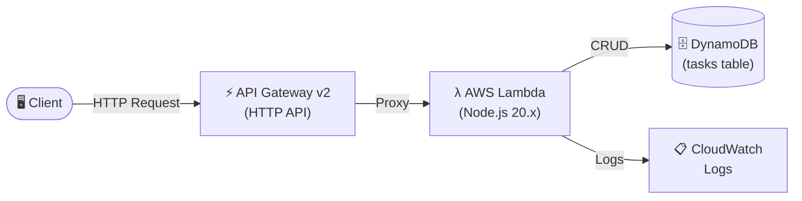

# Task API


A serverless REST API for managing tasks, built on AWS using Node.js and TypeScript.

Built as a hands-on learning project with **Claude as a mentor** — Claude assigned tasks in ask mode while I researched and implemented each piece. The goal was to go beyond knowing the basics and actually wire everything together end-to-end on AWS.

---

## Architecture



---

## What I learned

I came in knowing the basic use cases and features of these AWS services, but this project is where I implemented them from scratch:

| Service | What I implemented |
|---|---|
| **AWS Lambda** | Running an Express app as a serverless function using `serverless-http` |
| **Amazon DynamoDB** | NoSQL table with on-demand billing, partition key, and SDK v3 DocumentClient |
| **API Gateway v2** | HTTP API with a catch-all proxy route forwarding all requests to Lambda |
| **IAM Roles & Policies** | Least-privilege permissions for Lambda to access DynamoDB and CloudWatch |
| **AWS SDK v3** | Using `@aws-sdk/client-dynamodb` and `@aws-sdk/lib-dynamodb` for typed DynamoDB operations |
| **Terraform** | Provisioning all AWS infrastructure as code |

---

## Tech stack

- **Runtime** — Node.js 20.x + TypeScript
- **Framework** — Express + `serverless-http`
- **Database** — Amazon DynamoDB (AWS SDK v3)
- **Infrastructure** — Terraform
- **Deployment** — AWS Lambda + API Gateway v2

---

## API Endpoints

| Method | Endpoint | Description |
|---|---|---|
| `GET` | `/tasks` | Get all tasks |
| `POST` | `/tasks` | Create a task |
| `GET` | `/tasks/:id` | Get task by ID |
| `DELETE` | `/tasks/:id` | Delete a task |

### Request body (POST /tasks)

```json
{
  "title": "My task",
  "description": "Task description"
}
```

---

## Project structure

```
src/
├── app.ts                        # Express app setup
├── lambda.ts                     # Lambda handler entry point
├── local.ts                      # Local dev server
├── routes/
│   └── tasks.ts                  # Route definitions
├── services/
│   └── dynamo.service.ts         # DynamoDB operations
└── interfaces/
    └── task.interface.ts
terraform/
└── main.tf                       # All AWS infrastructure
```

---

## Getting started

### Prerequisites

- Node.js 20+
- AWS CLI configured (`aws configure`)
- Terraform 1.x

### Environment variables

Create a `.env` file in the root:

```env
PORT=3000
AWS_REGION=ap-south-1
TABLE_NAME=tasks
```

### Run locally

```bash
npm install
npm run dev
```

### Deploy to AWS

```bash
# 1. Build
npm run build

# 2. Package (includes node_modules for Lambda runtime)
Compress-Archive -Path dist, node_modules -DestinationPath lambda.zip -Force

# 3. Deploy
terraform -chdir=terraform apply
```
